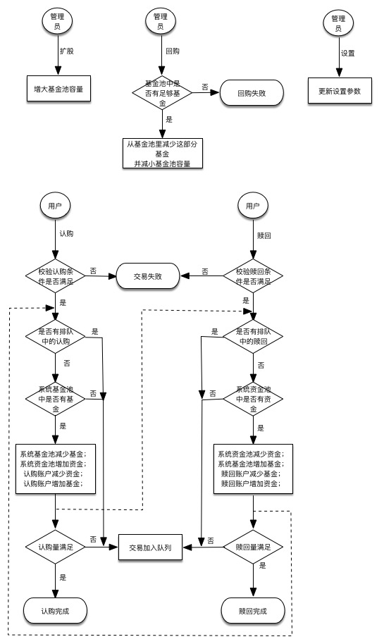

## 设计实现

funds基于Hypperledger实现的基金管理，Hyperledger为我们提供了如下的功能：

* 用户管理

Hyperledger的membersrvc模块提供了基本的用户管理功能，基于PKI体系的用户系统保证了交易的安全性。用户管理本身采用配置文件进行初始化，我们会进行一些扩展。

* 共识算法

共识算法提供了在分布式环境下解决数据一致性问题的方法。

* 区块链存储

区块链存储把所有的交易结果都存储在区块链上，称为ledger，任何人都可以查询ledger上的信息。

### 架构设计

架构设计包含三大部分：web client、App、Hyperledger。如下图

web client：提供对外操作UI，实现user的输入输出简单处理后向App发送http request并接收response。

App：连接client与Hyperledger的中间层，负责接收client的httprequest，将request数据整理打包后通过Hyperledger提供API发送给Hyperledger处理；Hyperledger处理完成后返回处理结果给App，并有App包装后返回给client。

Hyperledger：基金管理系统底层区块链技术实现，提供memberSrv服务、peer共识服务、chaincode服务。负责执行交易并将交易相关信息保存于Ledger中。

###数据结构及流程

####数据结构

1. 基金基本信息：基金序号、基金名称
2. 基金净值：基金序号、净值
3. 基金池：基金序号、基金池中份数
4. 基金参与限制：基金序号、参与者资金量、参与者注册时间、认购起点
5. 基金认购限制：基金序号、认购单量、认购总量
6. 账户信息：账户证书、资金量、注册时间
7. 用户基金信息：账户证书、基金序号、所购基金份额
8. 排队信息：交易者证书、基金序号、交易额（认购或赎回）、申请时间

以上数据结构对应的数据都通过chaincode操作并保存在block的worldstate里。另外，系统账户的注册由Hyperledger的membersrv服务实现。

####系统流程

如下图流程图内所展示的逻辑是在chaincode实现。

###APP接口设计

App模块为web client提供REST API。

#### 账户注册API

#### 基金设置API

#### 基金交易API

#### 历史数据API