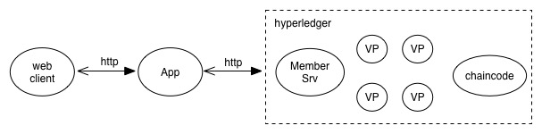

## 设计实现

funds基于Hypperledger实现的基金管理，Hyperledger为我们提供了如下的功能：

* 用户管理

Hyperledger的membersrvc模块提供了基本的用户管理功能，基于PKI体系的用户系统保证了交易的安全性。用户管理本身采用配置文件进行初始化，我们会进行一些扩展。

* 共识算法

共识算法提供了在分布式环境下解决数据一致性问题的方法。

* 区块链存储

区块链存储把所有的交易结果都存储在区块链上，称为ledger，任何人都可以查询ledger上的信息。

### 架构设计

架构设计包含三大部分：web client、App、Hyperledger。如下图



web client：提供对外操作UI，实现user的输入输出简单处理后向App发送http request并接收response。

App：连接client与Hyperledger的中间层，负责接收client的httprequest，将request数据整理打包后通过Hyperledger提供API发送给Hyperledger处理；Hyperledger处理完成后返回处理结果给App，并有App包装后返回给client。

Hyperledger：基金管理系统底层区块链技术实现，提供memberSrv服务、peer共识服务、chaincode服务。负责执行交易并将交易相关信息保存于Ledger中。

###数据结构及流程

####数据结构

1. 基金基本信息：基金序号、基金名称、管理员
2. 基金净值：基金序号、净值
3. 系统全局量：基金序号、基金池容量、基金池中剩余基金数、系统资金量
4. 基金参与限制：基金序号、参与者资金量、参与者注册时间、认购起点
5. 基金认购限制：基金序号、认购单量、认购总量
6. 账户信息：账户证书、资金量、注册时间
7. 用户基金信息：账户证书、基金序号、所购基金份额
8. 排队信息：交易者证书、基金序号、交易额（认购或赎回）、申请时间

以上数据结构对应的数据都通过chaincode操作并保存在block的worldstate里。另外，系统账户的注册由Hyperledger的membersrv服务实现。

####系统流程

如下图流程图内所展示的逻辑是在chaincode实现。


###APP接口设计

App模块为web client提供REST API。

#### 账户注册API

* 账户注册接口 实现管理员用户与普通用户的注册
* 用户登录

#### 基金设置API

* 创建基金  创建一只新基金，初始化其名称、净值、基金池、资金池以及参与限制和认购限制
* 设置基金净值
* 设置基金参与限制与认购限制

#### 基金交易API

* 管理员扩股
* 管理员回购
* 投资者认购
* 投资者赎回

#### 数据统计API

* 基金净值历史记录
* 查询基金信息
* 基金池、资金池、交易队列状况


###Hyperledger API

#### 初始化

Deploy Request:

```
POST host:port/chaincode
{
    "jsonrpc": "2.0",
    "method": "deploy",
    "params": {
        "type": "GOLANG",
        "chaincodeID": {
            "path": "",
            "name": ""
        },
        "ctorMsg": {
            "args": "[][]byte{}"//参数 init
        },
        "timeout": 0,
        "secureContext": "string",
        "confidentialityLevel": 1,
        "metadata": "[]byte {}",
        "attributes": "[]string{}"
    },
    "id": {
        "StringValue": "*string",
        "IntValue": "*int64"
    }
}
```

Deploy Response:

```
{
    "jsonrpc": "2.0",
    "result": {
        "status": "ok",
        "message": "xxxx"
    },
    "id": {
        "StringValue": "*string",
        "IntValue": "*int64"
    }
}
```

#### 创建基金

Invoke Request:

```
POST host:port/chaincode
{
    "jsonrpc": "2.0",
    "method": "invoke",
    "params": {
        "type": "GOLANG",
        "chaincodeID": {
            "path": "",
            "name": ""
        },
        "ctorMsg": {
            "args": "[][]byte{}"//参数 1、“createFund“ 2、基金名称string  3、基金管理员  4、基金净值 5、基金池 6、系统资金 7、参与者资金量 8、参与者注册时间 9、认购起点 10、认购单量 11、认购总量 12、基金净值
        },
        "timeout": 0,
        "secureContext": "string",
        "confidentialityLevel": 1,
        "metadata": "[]byte {}",
        "attributes": "[]string{}"
    },
    "id": {
        "StringValue": "*string",
        "IntValue": "*int64"
    }
}
```

Invoke Response:

```
{
    "jsonrpc": "2.0",
    "result": {
        "status": "ok",
        "message": "xxxx"
    },
    "id": {
        "StringValue": "*string",
        "IntValue": "*int64"
    }
}
```

#### 设置基金净值

Invoke Request:

```
POST host:port/chaincode
{
    "jsonrpc": "2.0",
    "method": "invoke",
    "params": {
        "type": "GOLANG",
        "chaincodeID": {
            "path": "",
            "name": ""
        },
        "ctorMsg": {
            "args": "[][]byte{}"//参数 1、“setNet“ 2、基金名  3、净值int
        },
        "timeout": 0,
        "secureContext": "string",
        "confidentialityLevel": 1,
        "metadata": "[]byte {}",
        "attributes": "[]string{}"
    },
    "id": {
        "StringValue": "*string",
        "IntValue": "*int64"
    }
}
```

Invoke Response:

```
{
    "jsonrpc": "2.0",
    "result": {
        "status": "ok",
        "message": "xxxx"
    },
    "id": {
        "StringValue": "*string",
        "IntValue": "*int64"
    }
}
```

#### 设置基金池（扩股、回购）

Invoke Request:

```
POST host:port/chaincode
{
    "jsonrpc": "2.0",
    "method": "invoke",
    "params": {
        "type": "GOLANG",
        "chaincodeID": {
            "path": "",
            "name": ""
        },
        "ctorMsg": {
            "args": "[][]byte{}"//参数 1、“setFoundPool“ 2、基金名  3、扩股/回购数（>0为扩股 <0为回购）
        },
        "timeout": 0,
        "secureContext": "string",
        "confidentialityLevel": 1,
        "metadata": "[]byte {}",
        "attributes": "[]string{}"
    },
    "id": {
        "StringValue": "*string",
        "IntValue": "*int64"
    }
}
```

Invoke Response:

```
{
    "jsonrpc": "2.0",
    "result": {
        "status": "ok",
        "message": "xxxx"
    },
    "id": {
        "StringValue": "*string",
        "IntValue": "*int64"
    }
}
```

#### 基金交易（认购赎回）

Invoke Request:

```
POST host:port/chaincode
{
    "jsonrpc": "2.0",
    "method": "invoke",
    "params": {
        "type": "GOLANG",
        "chaincodeID": {
            "path": "",
            "name": ""
        },
        "ctorMsg": {
            "args": "[][]byte{}"//参数 1、“transferFound“ 2、基金ID  3、认购/赎回数（>0为认购 <0为赎回）
        },
        "timeout": 0,
        "secureContext": "string",
        "confidentialityLevel": 1,
        "metadata": "[]byte {}",
        "attributes": "[]string{}"
    },
    "id": {
        "StringValue": "*string",
        "IntValue": "*int64"
    }
}
```

Invoke Response:

```
{
    "jsonrpc": "2.0",
    "result": {
        "status": "ok",
        "message": "xxxx" //如果交易成功则为交易额（可能是部分交易完成），否则为错误信息
    },
    "id": {
        "StringValue": "*string",
        "IntValue": "*int64"
    }
}
```

#### 基金限制设置

Invoke Request:

```
POST host:port/chaincode
{
    "jsonrpc": "2.0",
    "method": "invoke",
    "params": {
        "type": "GOLANG",
        "chaincodeID": {
            "path": "",
            "name": ""
        },
        "ctorMsg": {
            "args": "[][]byte{}"//参数 1、“setFundLimit“ 2、基金名  3、参与者资金量 4、参与者注册时间 5、认购起点 6、认购单量 7、认购总量 
        },
        "timeout": 0,
        "secureContext": "string",
        "confidentialityLevel": 1,
        "metadata": "[]byte {}",
        "attributes": "[]string{}"
    },
    "id": {
        "StringValue": "*string",
        "IntValue": "*int64"
    }
}
```

Invoke Response:

```
{
    "jsonrpc": "2.0",
    "result": {
        "status": "ok",
        "message": "xxxx" //如果交易成功则为交易额（可能是部分交易完成），否则为错误信息
    },
    "id": {
        "StringValue": "*string",
        "IntValue": "*int64"
    }
}
```

#### 基金/列表信息查询

Query Request:

```
POST host:port/chaincode
{
    "jsonrpc": "2.0",
    "method": "query",
    "params": {
        "type": "GOLANG",
        "chaincodeID": {
            "path": "",
            "name": ""
        },
        "ctorMsg": {
            "args": "[][]byte{}"//参数 1、“getFund“ 2、one/list 3、基金ID（第二个参数为one时需要此参数） 
        },
        "timeout": 0,
        "secureContext": "string",
        "confidentialityLevel": 1,
        "metadata": "[]byte {}",
        "attributes": "[]string{}"
    },
    "id": {
        "StringValue": "*string",
        "IntValue": "*int64"
    }
}
```

Query Response:

```
{
    "jsonrpc": "2.0",
    "result": {
        "status": "ok",
        "message": "xxxx" //基金信息（包括所有基本信息的struct）
    },
    "id": {
        "StringValue": "*string",
        "IntValue": "*int64"
    }
}
```

#### 基金净值/列表查询

Query Request:

```
POST host:port/chaincode
{
    "jsonrpc": "2.0",
    "method": "query",
    "params": {
        "type": "GOLANG",
        "chaincodeID": {
            "path": "",
            "name": ""
        },
        "ctorMsg": {
            "args": "[][]byte{}"//参数 1、“getFundList“ 2、one/list  3、基金ID
        },
        "timeout": 0,
        "secureContext": "string",
        "confidentialityLevel": 1,
        "metadata": "[]byte {}",
        "attributes": "[]string{}"
    },
    "id": {
        "StringValue": "*string",
        "IntValue": "*int64"
    }
}
```

Query Response:

```
{
    "jsonrpc": "2.0",
    "result": {
        "status": "ok",
        "message": "xxxx" //基金净值信息
    },
    "id": {
        "StringValue": "*string",
        "IntValue": "*int64"
    }
}
```

#### 注册

Enrollment Request:

```
POST host:port/registrar

{
  "enrollId": "lukas",
  "enrollSecret": "NPKYL39uKbkj"
}

```

Enrollment Response:

```
{
    "OK": "Login successful for user 'lukas'."
}
```